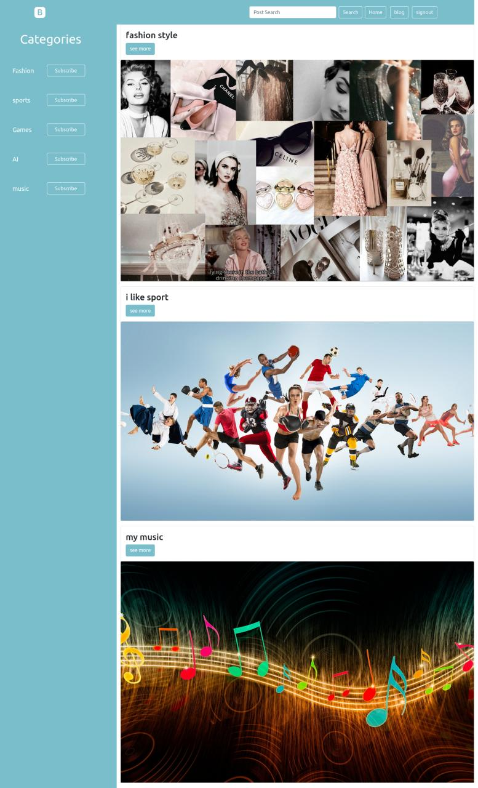
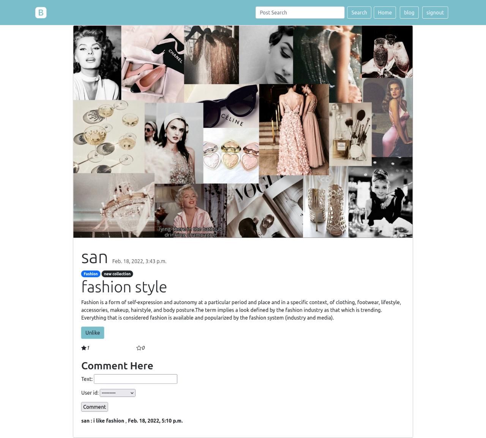
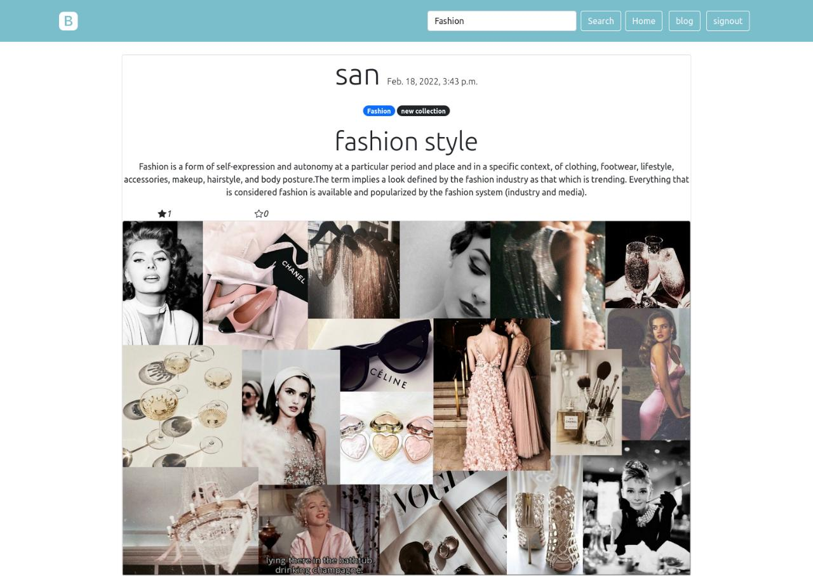
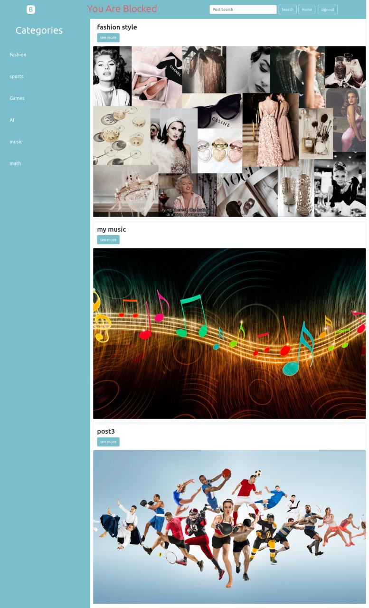
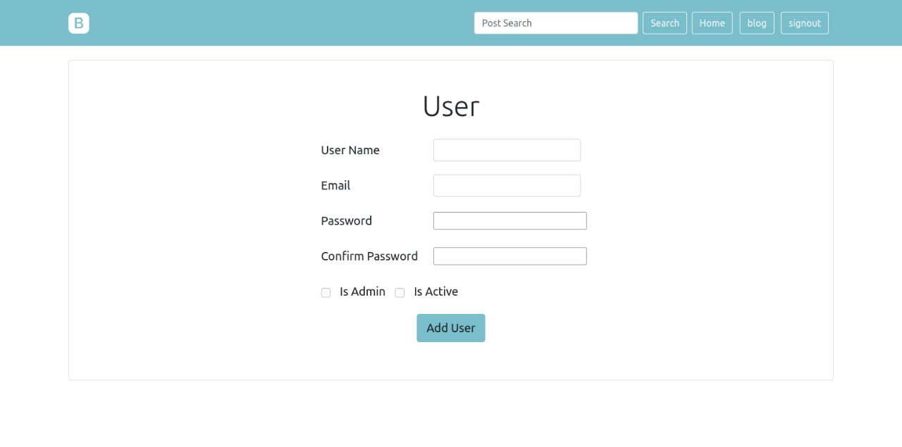
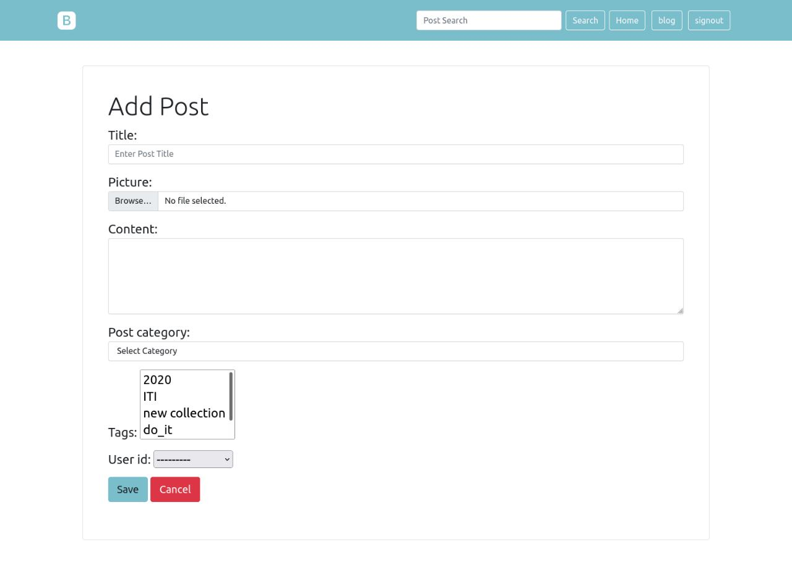
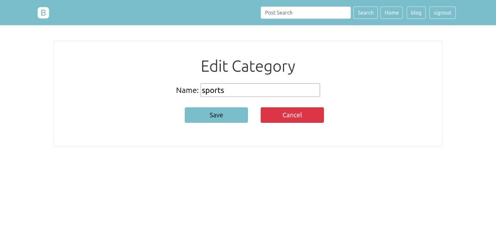
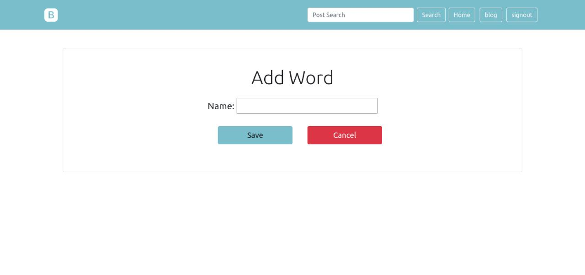
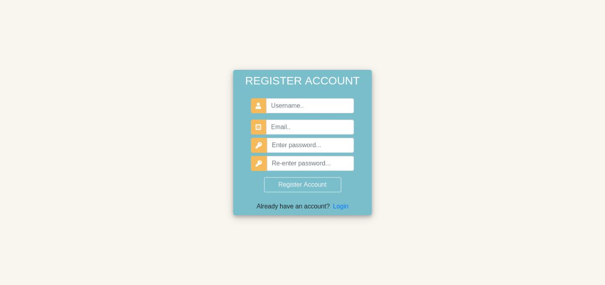
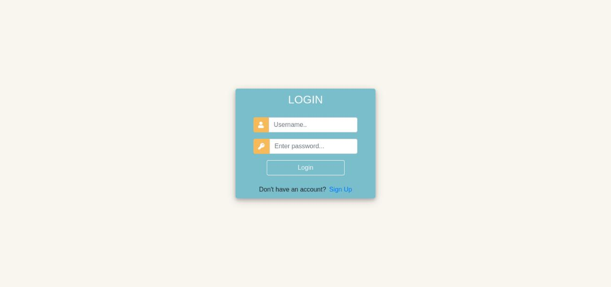

# Django Blog Project

<b>The project contain landing page that display all posts and categories</b>

- <b>you can see the details for each post in a separite page</b>
    - post content
    - post likes counter 
    - post comments
    - if you are user you can like or comment on post

- <b>you can search for any post with category or tag</b>

- <b>if user blocked from admin he won't be able to :</b>
    - subscribe or unsubscribe
    - like or dislike any post
    - read or write any comment

- <b>you can see the posts in each category</b>
    - you can subscribe and unsubscribe any category
- <b>if you are admin you are admin you can access blog page</b>
    - you can see , delete , edit and add :
        - user
        - post
        - category
        - forbidden word

- <b>finally your welcome to be one of our blog application</b>
    - you can register
    - and login our blog

### Contact Us

### Muhab Seif
[Github](https://github.com/muhab404)

[Linked in](https://www.linkedin.com/in/muhab-seif)

### Mounir adel 
[Github](https://github.com/MenoTrix)

[Linked in](https://www.linkedin.com/in/mounir-adel-294449204/)

### Mostafa Atef
[Github](https://github.com/MostafaAtefMohamed)

[Linked in](https://www.linkedin.com/in/mostafa-atef-b21532206/)

### Noura Mansour
[Github](https://github.com/NouraMansour)

[Linked in](https://www.linkedin.com/in/noura-mansour-74bb89236) 

### Yostos Boules
[Github](https://github.com/YostosB)

[Linked in](https://www.linkedin.com/in/yostos-boules-74675011a/)

